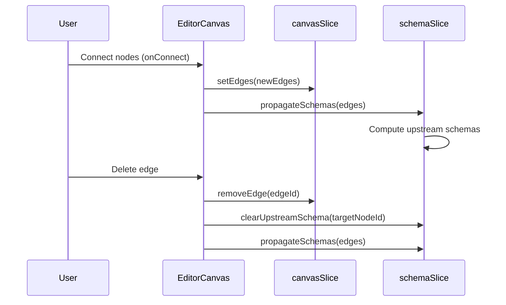
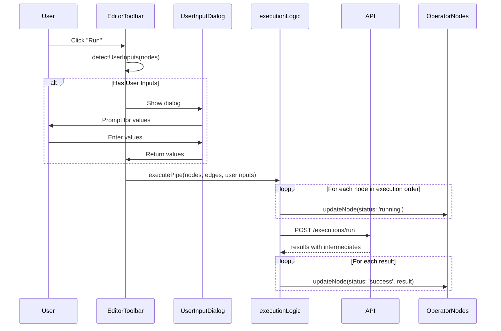

# Design Document: Editor & Pipeline Bugfixes

## Overview

This design addresses critical bugs preventing the Yahoo Pipes editor from functioning correctly. The fixes focus on:

1. **Schema Flow** - Proper propagation through the graph
2. **Visual Feedback** - Arrows, status indicators, results display
3. **Execution Flow** - User inputs, run selected, error handling
4. **UX Polish** - Single notifications, realistic defaults

## Architecture Changes

### 1. Schema Propagation Flow



### 2. Execution Flow with User Inputs



## Component Changes

### EditorCanvas.tsx Changes

```typescript
// Current onConnect - MISSING schema propagation
const onConnect = useCallback((connection: Connection) => {
  // ... validation ...
  dispatch(setEdges(updatedEdges));
}, []);

// Fixed onConnect - WITH schema propagation
const onConnect = useCallback((connection: Connection) => {
  // ... validation ...
  dispatch(setEdges(updatedEdges));
  dispatch(propagateSchemas({ edges: updatedEdges })); // ADD THIS
}, []);

// Current edge delete - MISSING schema cleanup
// Fixed: Add schema cleanup on edge delete
const handleDeleteEdge = useCallback((edgeId: string) => {
  const edge = edges.find(e => e.id === edgeId);
  dispatch(saveToHistory());
  dispatch(removeEdge(edgeId));
  if (edge) {
    dispatch(clearUpstreamSchema(edge.target)); // ADD THIS
    dispatch(propagateSchemas({ edges: edges.filter(e => e.id !== edgeId) })); // ADD THIS
  }
}, [dispatch, edges]);
```

### EditorToolbar.tsx Changes

```typescript
// Add user input detection
const detectUserInputNodes = (nodes: Node[]): Node[] => {
  const inputTypes = ['text-input', 'number-input', 'url-input', 'date-input'];
  return nodes.filter(n => inputTypes.includes(n.type || ''));
};

// Modified handleExecute
const handleExecute = async () => {
  const validation = validatePipeForExecution(nodes, edges);
  if (!validation.valid) {
    addToast({ type: 'error', title: 'Cannot execute pipe', description: validation.errors.join(', ') });
    return;
  }

  // Check for user inputs
  const inputNodes = detectUserInputNodes(nodes);
  let userInputs: Record<string, string | number | undefined> | undefined;
  
  if (inputNodes.length > 0) {
    // Show dialog and collect values
    const values = await showUserInputDialog(inputNodes);
    if (!values) return; // User cancelled
    userInputs = values;
  }

  dispatch(setIsExecuting(true));
  
  // Update node statuses to 'running' before execution
  nodes.forEach(node => {
    dispatch(updateNode({ id: node.id, data: { status: 'running' } }));
  });
  
  try {
    const result = await executePipe(nodes, edges, userInputs);
    
    // Update each node with its intermediate result
    if (result.intermediateResults) {
      Object.entries(result.intermediateResults).forEach(([nodeId, intermediate]) => {
        dispatch(updateNode({
          id: nodeId,
          data: {
            status: intermediate.status === 'success' ? 'success' : 'error',
            result: intermediate.result,
            error: intermediate.error,
          },
        }));
      });
    }
    
    const formattedResult = formatExecutionResult(result);
    dispatch(setExecutionResult(formattedResult));
    
    if (formattedResult.status === 'success') {
      addToast({ type: 'success', title: 'Execution completed' });
    } else {
      addToast({ type: 'error', title: 'Execution failed', description: formattedResult.error });
    }
  } catch (error: any) {
    // Reset node statuses on error
    nodes.forEach(node => {
      dispatch(updateNode({ id: node.id, data: { status: 'idle' } }));
    });
    
    addToast({ type: 'error', title: 'Execution failed', description: error.message });
  } finally {
    dispatch(setIsExecuting(false));
  }
};
```

### SelectableEdge.tsx Changes

```typescript
// Add proper arrow marker definition
const ARROW_MARKER_ID = 'edge-arrow';

// In render, add marker definition
<defs>
  <marker
    id={`${ARROW_MARKER_ID}-${id}`}
    viewBox="0 0 10 10"
    refX="8"
    refY="5"
    markerUnits="strokeWidth"
    markerWidth="6"
    markerHeight="6"
    orient="auto-start-reverse"
  >
    <path
      d="M 0 0 L 10 5 L 0 10 z"
      fill={selected ? SELECTED_COLOR : isHovered ? HOVER_COLOR : GRADIENT_END}
    />
  </marker>
  {/* ... existing gradient ... */}
</defs>

// Use the marker on BaseEdge
<BaseEdge
  id={id}
  path={edgePath}
  markerEnd={`url(#${ARROW_MARKER_ID}-${id})`}
  style={{...}}
/>
```

### canvas-slice.ts Changes - Realistic Default Pipeline

```typescript
// Better default pipeline with Filter
const DEFAULT_NODES: OperatorNode[] = [
  {
    id: 'fetch-1',
    type: 'fetch-json',
    position: { x: 100, y: 150 },
    data: {
      label: 'Fetch JSON',
      config: {
        url: 'https://jsonplaceholder.typicode.com/posts',
      },
    },
  },
  {
    id: 'filter-1',
    type: 'filter',
    position: { x: 400, y: 150 },
    data: {
      label: 'Filter',
      config: {
        mode: 'permit',
        matchMode: 'all',
        rules: [
          { field: 'userId', operator: 'equals', value: '1' }
        ],
      },
    },
  },
  {
    id: 'truncate-1',
    type: 'truncate',
    position: { x: 700, y: 150 },
    data: {
      label: 'Truncate',
      config: {
        count: 5,
      },
    },
  },
  {
    id: 'output-1',
    type: 'pipe-output',
    position: { x: 1000, y: 150 },
    data: {
      label: 'Pipe Output',
      config: {},
    },
  },
];

const DEFAULT_EDGES: Edge[] = [
  {
    id: 'e-fetch-1-filter-1',
    source: 'fetch-1',
    target: 'filter-1',
    type: 'selectable',
  },
  {
    id: 'e-filter-1-truncate-1',
    source: 'filter-1',
    target: 'truncate-1',
    type: 'selectable',
  },
  {
    id: 'e-truncate-1-output-1',
    source: 'truncate-1',
    target: 'output-1',
    type: 'selectable',
  },
];
```

### OperatorNode.tsx Changes - Add Run Selected Button

```typescript
// Add Run Selected button for non-source operators
const handleRunSelected = useCallback(async (e: React.MouseEvent) => {
  e.stopPropagation();
  // Dispatch action to run from this node
  // This will be implemented via a new Redux action
}, [id]);

// In render, add button in header (for non-source operators)
{!isSourceOperator(operatorType) && (
  <button
    onClick={handleRunSelected}
    onMouseDown={(e) => e.stopPropagation()}
    className="opacity-0 group-hover:opacity-100 p-1 rounded hover:bg-white/20 transition-opacity"
    title="Run from here"
  >
    <svg className="w-3 h-3 text-white" fill="currentColor" viewBox="0 0 24 24">
      <path d="M8 5v14l11-7z" />
    </svg>
  </button>
)}
```

### Backend Operator Error Messages

```typescript
// filter-operator.ts - Better error message
async execute(input: any, config: FilterConfig, _context?: any): Promise<any> {
  if (!this.isArray(input)) {
    const inputType = input === null ? 'null' : 
                      input === undefined ? 'undefined' : 
                      typeof input;
    throw new Error(`Filter requires array input, received ${inputType}. Connect to a source operator that outputs an array.`);
  }
  // ... rest of implementation
}

// sort-operator.ts - Better error message  
async execute(input: any, config: SortConfig, _context?: any): Promise<any> {
  if (!this.isArray(input)) {
    const inputType = input === null ? 'null' : 
                      input === undefined ? 'undefined' : 
                      typeof input;
    throw new Error(`Sort requires array input, received ${inputType}. Connect to a source operator that outputs an array.`);
  }
  // ... rest of implementation
}
```

## Toast Deduplication

```typescript
// In FetchJSONInlineConfig - REMOVE the success toast (preview is just for schema)
const handlePreview = useCallback(async () => {
  if (!config.url) return;
  const result = await preview('fetch-json', config);
  // REMOVE: No toast here - preview is silent for schema extraction
  // Toast only on error (already handled by useSchema hook)
}, [config, preview]);
```

## Correctness Properties

### Property 1: Schema Propagation on Connect
*For any* edge creation between nodes, the downstream node's upstream schema SHALL be updated to match the source node's output schema.
**Validates: Requirement 1.1**

### Property 2: Schema Clear on Disconnect
*For any* edge deletion, the target node's upstream schema SHALL be cleared.
**Validates: Requirement 1.2**

### Property 3: Single Toast Per Action
*For any* user action (preview, execute, save), at most one toast notification SHALL appear.
**Validates: Requirement 2.1, 2.2**

### Property 4: Arrow Visibility
*For any* rendered edge, an arrow marker SHALL be visible at the target end indicating data flow direction.
**Validates: Requirement 3.1**

### Property 5: Node Status Progression
*For any* pipe execution, each node SHALL transition through: idle → running → success|error.
**Validates: Requirement 6.1, 6.2, 6.3**

### Property 6: User Input Collection
*For any* pipe containing user input operators, execution SHALL be preceded by value collection.
**Validates: Requirement 7.1, 7.2, 7.3**

### Property 7: Descriptive Error Messages
*For any* operator failure, the error message SHALL include: operator name, expected input type, received input type.
**Validates: Requirement 9.1, 9.2, 9.4**

## Files to Modify

| File | Change Type | Description |
|------|-------------|-------------|
| `frontend/src/pages/editor/components/EditorCanvas.tsx` | Modify | Add schema propagation on connect/delete |
| `frontend/src/pages/editor/components/EditorToolbar.tsx` | Modify | Add user input detection, node status updates |
| `frontend/src/components/editor/SelectableEdge.tsx` | Modify | Add proper arrow markers |
| `frontend/src/components/editor/OperatorNode.tsx` | Modify | Add Run Selected button |
| `frontend/src/store/slices/canvas-slice.ts` | Modify | Update default pipeline |
| `frontend/src/components/editor/inline-config/FetchJSONInlineConfig.tsx` | Modify | Remove duplicate toast |
| `frontend/src/components/editor/UserInputPromptDialog.tsx` | Modify | Integrate with execution flow |
| `backend/src/operators/filter-operator.ts` | Modify | Better error messages |
| `backend/src/operators/sort-operator.ts` | Modify | Better error messages |

## Testing Strategy

### Manual Testing Checklist

1. **Schema Propagation**
   - [ ] Create Fetch JSON → Filter connection, verify Filter shows field dropdown
   - [ ] Delete the connection, verify Filter dropdown is cleared
   - [ ] Preview Fetch JSON, verify downstream Filter updates

2. **Toast Notifications**
   - [ ] Preview a source, verify no toast appears
   - [ ] Execute pipe, verify exactly one toast appears
   - [ ] Execute with error, verify error toast appears once

3. **Arrow Markers**
   - [ ] Create connection, verify arrow points to target
   - [ ] Select edge, verify arrow color changes
   - [ ] Hover edge, verify arrow is visible

4. **Default Pipeline**
   - [ ] Open new editor, verify 4-node pipeline
   - [ ] Click Run, verify execution succeeds
   - [ ] Verify results show filtered, truncated posts

5. **Node Status**
   - [ ] Execute pipe, watch nodes transition to 'running'
   - [ ] Verify successful nodes turn green
   - [ ] Verify failed nodes turn red

6. **User Inputs**
   - [ ] Add Text Input operator
   - [ ] Click Run, verify dialog appears
   - [ ] Enter value, verify execution uses it

7. **Error Messages**
   - [ ] Connect Fetch Page (returns HTML) to Filter
   - [ ] Execute, verify error says "Filter requires array input"

