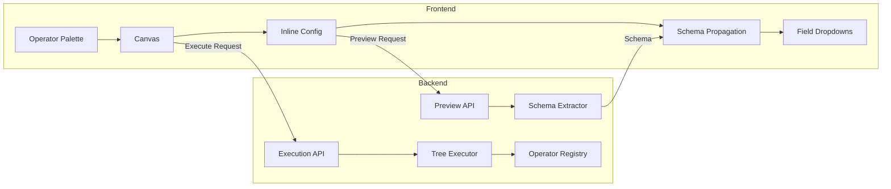
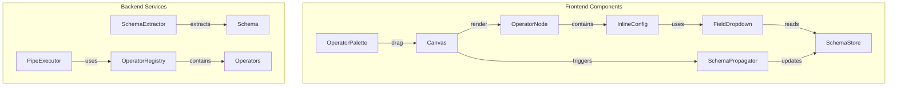
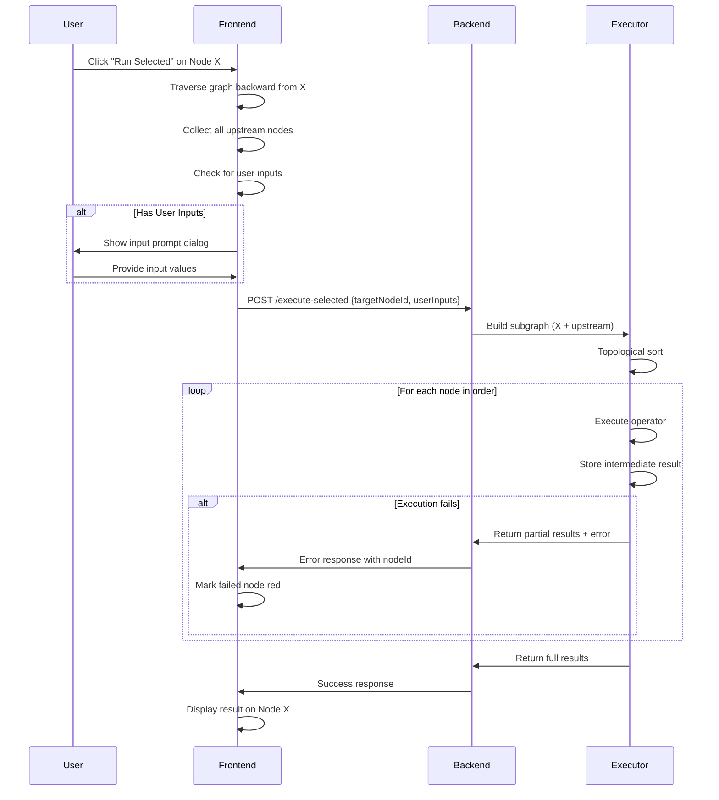

# Design Document: Yahoo Pipes Canvas Enhancement

## Overview

This design transforms the current basic pipe editor into a true Yahoo Pipes-style visual data mashup tool. The key architectural changes include:

1. **Dynamic Schema Propagation** - Operators discover and share field schemas through the graph
2. **Inline Configuration** - All operator config is embedded in nodes (removing the side panel)
3. **Expanded Operator Library** - New source types, user inputs, string/URL operators
4. **Tree-Based Execution** - "Run Selected" traces upstream and executes the subgraph
5. **Categorized Palette** - Operators organized by function (Sources, User Inputs, Operators, String, URL)

### Architecture Principles

- **Single Input Per Operator** - No merging/joining (simplifies execution model)
- **Schema-Driven UI** - Downstream operators auto-populate field dropdowns from upstream schema
- **Backward Compatible** - Existing pipes continue to work with the new engine
- **Security First** - All existing security guardrails (domain whitelist, private IP blocking, secrets encryption) remain enforced

## Architecture

### High-Level Data Flow



### Component Architecture



## Components and Interfaces

### Backend Components

#### 1. Schema Extractor Service

New service to extract field schemas from data samples.

```typescript
// backend/src/services/schema-extractor.ts

export interface SchemaField {
  name: string;           // Field name (e.g., "user.name")
  path: string;           // Full dot-notation path
  type: 'string' | 'number' | 'boolean' | 'array' | 'object' | 'null' | 'date';
  children?: SchemaField[]; // For nested objects
  sample?: any;           // Sample value for preview
}

export interface ExtractedSchema {
  fields: SchemaField[];
  rootType: 'array' | 'object';
  itemCount?: number;     // For arrays
}

export class SchemaExtractor {
  /**
   * Extract schema from JSON data
   * Traverses nested objects using dot notation
   */
  extract(data: any): ExtractedSchema;
  
  /**
   * Extract schema from CSV data
   * Uses header row as field names
   */
  extractFromCSV(csvText: string): ExtractedSchema;
  
  /**
   * Extract schema from RSS/Atom feed
   * Normalizes to standard fields: title, link, description, pubDate
   */
  extractFromRSS(xmlText: string): ExtractedSchema;
  
  /**
   * Flatten nested schema to dot-notation paths
   */
  flattenSchema(schema: ExtractedSchema): string[];
}
```

#### 2. Enhanced Operator Base Classes

Operators organized by category with shared base functionality.

```typescript
// backend/src/operators/base-operator.ts (enhanced)

export abstract class BaseOperator implements IOperator {
  abstract type: string;
  abstract category: OperatorCategory;
  abstract description: string;
  
  // Existing methods...
  abstract execute(input: any, config: any, context?: ExecutionContext): Promise<any>;
  abstract validate(config: any): ValidationResult;
  
  // New: Schema output declaration
  abstract getOutputSchema(inputSchema?: ExtractedSchema, config?: any): ExtractedSchema | null;
}

export type OperatorCategory = 'sources' | 'user-inputs' | 'operators' | 'string' | 'url';
```

#### 3. New Source Operators

```typescript
// backend/src/operators/sources/fetch-json-operator.ts
export class FetchJSONOperator extends BaseOperator {
  type = 'fetch-json';
  category: OperatorCategory = 'sources';
  description = 'Fetch and parse JSON data from a URL';
}

// backend/src/operators/sources/fetch-csv-operator.ts
export class FetchCSVOperator extends BaseOperator {
  type = 'fetch-csv';
  category: OperatorCategory = 'sources';
  description = 'Fetch and parse CSV data into JSON array';
}

// backend/src/operators/sources/fetch-rss-operator.ts
export class FetchRSSOperator extends BaseOperator {
  type = 'fetch-rss';
  category: OperatorCategory = 'sources';
  description = 'Fetch and parse RSS/Atom feeds';
}

// backend/src/operators/sources/fetch-page-operator.ts
export class FetchPageOperator extends BaseOperator {
  type = 'fetch-page';
  category: OperatorCategory = 'sources';
  description = 'Fetch HTML and extract data with CSS selectors';
}
```

#### 4. User Input Operators

```typescript
// backend/src/operators/user-inputs/text-input-operator.ts
export class TextInputOperator extends BaseOperator {
  type = 'text-input';
  category: OperatorCategory = 'user-inputs';
  description = 'Text input parameter for the pipe';
}

// backend/src/operators/user-inputs/number-input-operator.ts
export class NumberInputOperator extends BaseOperator {
  type = 'number-input';
  category: OperatorCategory = 'user-inputs';
  description = 'Numeric input with optional min/max constraints';
}

// backend/src/operators/user-inputs/url-input-operator.ts
export class URLInputOperator extends BaseOperator {
  type = 'url-input';
  category: OperatorCategory = 'user-inputs';
  description = 'URL input with validation';
}

// backend/src/operators/user-inputs/date-input-operator.ts
export class DateInputOperator extends BaseOperator {
  type = 'date-input';
  category: OperatorCategory = 'user-inputs';
  description = 'Date input parameter';
}
```

#### 5. Transformation Operators

```typescript
// backend/src/operators/transforms/unique-operator.ts
export class UniqueOperator extends BaseOperator {
  type = 'unique';
  category: OperatorCategory = 'operators';
  description = 'Remove duplicate items based on a field';
}

// backend/src/operators/transforms/truncate-operator.ts
export class TruncateOperator extends BaseOperator {
  type = 'truncate';
  category: OperatorCategory = 'operators';
  description = 'Keep only the first N items';
}

// backend/src/operators/transforms/tail-operator.ts
export class TailOperator extends BaseOperator {
  type = 'tail';
  category: OperatorCategory = 'operators';
  description = 'Keep only the last N items';
}

// backend/src/operators/transforms/rename-operator.ts
export class RenameOperator extends BaseOperator {
  type = 'rename';
  category: OperatorCategory = 'operators';
  description = 'Rename fields in items';
}
```

#### 6. String Operators

```typescript
// backend/src/operators/string/string-replace-operator.ts
export class StringReplaceOperator extends BaseOperator {
  type = 'string-replace';
  category: OperatorCategory = 'string';
  description = 'Replace text in a field';
}

// backend/src/operators/string/regex-operator.ts
export class RegexOperator extends BaseOperator {
  type = 'regex';
  category: OperatorCategory = 'string';
  description = 'Apply regex pattern to extract or replace content';
}

// backend/src/operators/string/substring-operator.ts
export class SubstringOperator extends BaseOperator {
  type = 'substring';
  category: OperatorCategory = 'string';
  description = 'Extract portion of a string by indices';
}
```

#### 7. URL Operators

```typescript
// backend/src/operators/url/url-builder-operator.ts
export class URLBuilderOperator extends BaseOperator {
  type = 'url-builder';
  category: OperatorCategory = 'url';
  description = 'Build URLs with query parameters';
}
```

#### 8. Pipe Output Operator

```typescript
// backend/src/operators/pipe-output-operator.ts
export class PipeOutputOperator extends BaseOperator {
  type = 'pipe-output';
  category: OperatorCategory = 'operators';
  description = 'Final output of the pipe';
  
  // Pass-through operator - just marks the end of the pipe
  async execute(input: any): Promise<any> {
    return input;
  }
}
```


### Frontend Components

#### 1. Inline Configuration Components

Each operator type gets a dedicated inline config component embedded in the node.

```typescript
// frontend/src/components/editor/inline-config/FetchJSONInlineConfig.tsx
interface FetchJSONInlineConfigProps {
  nodeId: string;
  config: FetchJSONConfig;
  onConfigChange: (config: FetchJSONConfig) => void;
  onPreview: () => void;
  isPreviewLoading: boolean;
  previewError?: string;
}

// frontend/src/components/editor/inline-config/FilterInlineConfig.tsx
interface FilterInlineConfigProps {
  nodeId: string;
  config: FilterConfig;
  onConfigChange: (config: FilterConfig) => void;
  upstreamSchema: SchemaField[];  // For field dropdowns
}

// frontend/src/components/editor/inline-config/SortInlineConfig.tsx
interface SortInlineConfigProps {
  nodeId: string;
  config: SortConfig;
  onConfigChange: (config: SortConfig) => void;
  upstreamSchema: SchemaField[];  // For field dropdown
}
```

#### 2. Enhanced OperatorNode Component

The OperatorNode now renders inline config instead of "Click to configure".

```typescript
// frontend/src/components/editor/OperatorNode.tsx (enhanced)

interface OperatorNodeData {
  label: string;
  config: OperatorConfig;
  status?: 'idle' | 'running' | 'success' | 'error';
  error?: string;
  outputSchema?: ExtractedSchema;  // NEW: Cached schema from preview/execution
  validationErrors?: string[];     // NEW: Real-time validation errors
  result?: any;                    // NEW: Execution result for display
}

export const OperatorNode: FC<NodeProps<OperatorNodeData>> = memo(({ id, data, type }) => {
  const upstreamSchema = useUpstreamSchema(id);  // Hook to get schema from connected upstream
  
  return (
    <div className="operator-node">
      {/* Header */}
      <div className="operator-header">...</div>
      
      {/* Inline Config - renders based on operator type */}
      <div className="operator-config">
        {renderInlineConfig(type, data.config, upstreamSchema)}
      </div>
      
      {/* Validation errors */}
      {data.validationErrors?.length > 0 && (
        <div className="validation-errors">...</div>
      )}
      
      {/* Result preview (when executed) */}
      {data.result && (
        <div className="result-preview">...</div>
      )}
    </div>
  );
});
```

#### 3. Schema Store (Redux)

New Redux slice to manage schema propagation state.

```typescript
// frontend/src/store/slices/schema-slice.ts

interface SchemaState {
  // Map of nodeId -> output schema
  nodeSchemas: Record<string, ExtractedSchema>;
  // Map of nodeId -> upstream schema (computed from connections)
  upstreamSchemas: Record<string, ExtractedSchema>;
  // Preview loading states
  previewLoading: Record<string, boolean>;
  previewErrors: Record<string, string>;
}

const schemaSlice = createSlice({
  name: 'schema',
  initialState,
  reducers: {
    setNodeSchema: (state, action: PayloadAction<{ nodeId: string; schema: ExtractedSchema }>) => {},
    clearNodeSchema: (state, action: PayloadAction<string>) => {},
    propagateSchemas: (state, action: PayloadAction<{ nodes: Node[]; edges: Edge[] }>) => {},
    setPreviewLoading: (state, action: PayloadAction<{ nodeId: string; loading: boolean }>) => {},
    setPreviewError: (state, action: PayloadAction<{ nodeId: string; error: string }>) => {},
  },
});
```

#### 4. Enhanced OperatorPalette with Categories

```typescript
// frontend/src/components/editor/OperatorPalette.tsx (enhanced)

const operatorCategories: OperatorCategory[] = [
  {
    id: 'sources',
    label: 'Sources',
    icon: '📥',
    operators: [
      { type: 'fetch-json', label: 'Fetch JSON', icon: '🌐', description: 'Fetch JSON from URL' },
      { type: 'fetch-csv', label: 'Fetch CSV', icon: '📊', description: 'Fetch and parse CSV' },
      { type: 'fetch-rss', label: 'Fetch RSS', icon: '📰', description: 'Fetch RSS/Atom feeds' },
      { type: 'fetch-page', label: 'Fetch Page', icon: '🌍', description: 'Fetch HTML with CSS selectors' },
    ],
  },
  {
    id: 'user-inputs',
    label: 'User Inputs',
    icon: '✏️',
    operators: [
      { type: 'text-input', label: 'Text Input', icon: '📝', description: 'Text parameter' },
      { type: 'number-input', label: 'Number Input', icon: '🔢', description: 'Numeric parameter' },
      { type: 'url-input', label: 'URL Input', icon: '🔗', description: 'URL parameter' },
      { type: 'date-input', label: 'Date Input', icon: '📅', description: 'Date parameter' },
    ],
  },
  {
    id: 'operators',
    label: 'Operators',
    icon: '⚙️',
    operators: [
      { type: 'filter', label: 'Filter', icon: '🔍', description: 'Filter items by rules' },
      { type: 'sort', label: 'Sort', icon: '↕️', description: 'Sort items by field' },
      { type: 'unique', label: 'Unique', icon: '🎯', description: 'Remove duplicates' },
      { type: 'truncate', label: 'Truncate', icon: '✂️', description: 'Keep first N items' },
      { type: 'tail', label: 'Tail', icon: '📋', description: 'Keep last N items' },
      { type: 'rename', label: 'Rename', icon: '🏷️', description: 'Rename fields' },
      { type: 'transform', label: 'Transform', icon: '🔄', description: 'Map fields' },
    ],
  },
  {
    id: 'string',
    label: 'String',
    icon: '📜',
    operators: [
      { type: 'string-replace', label: 'Replace', icon: '🔤', description: 'Replace text' },
      { type: 'regex', label: 'Regex', icon: '🔣', description: 'Regex extract/replace' },
      { type: 'substring', label: 'Substring', icon: '✂️', description: 'Extract substring' },
    ],
  },
  {
    id: 'url',
    label: 'URL',
    icon: '🔗',
    operators: [
      { type: 'url-builder', label: 'URL Builder', icon: '🏗️', description: 'Build URL with params' },
    ],
  },
];
```


## Data Models

### TypeScript Interfaces

```typescript
// backend/src/types/operator.types.ts (enhanced)

// Schema types
export interface SchemaField {
  name: string;
  path: string;
  type: 'string' | 'number' | 'boolean' | 'array' | 'object' | 'null' | 'date';
  children?: SchemaField[];
  sample?: any;
}

export interface ExtractedSchema {
  fields: SchemaField[];
  rootType: 'array' | 'object';
  itemCount?: number;
}

// Operator categories
export type OperatorCategory = 'sources' | 'user-inputs' | 'operators' | 'string' | 'url';

// Enhanced operator types
export type OperatorType = 
  // Sources
  | 'fetch-json' | 'fetch-csv' | 'fetch-rss' | 'fetch-page'
  // User Inputs
  | 'text-input' | 'number-input' | 'url-input' | 'date-input'
  // Operators
  | 'filter' | 'sort' | 'unique' | 'truncate' | 'tail' | 'rename' | 'transform'
  // String
  | 'string-replace' | 'regex' | 'substring'
  // URL
  | 'url-builder'
  // Special
  | 'pipe-output'
  // Legacy (backward compatibility)
  | 'fetch';

// New operator configs
export interface FetchJSONConfig {
  url: string;
  headers?: Record<string, string>;
  secretRef?: SecretRef;
}

export interface FetchCSVConfig {
  url: string;
  delimiter?: string;  // Default: ','
  hasHeader?: boolean; // Default: true
  headers?: Record<string, string>;
  secretRef?: SecretRef;
}

export interface FetchRSSConfig {
  url: string;
  maxItems?: number;   // Default: 50
}

export interface FetchPageConfig {
  url: string;
  selector: string;    // CSS selector
  attribute?: string;  // Extract attribute value (default: text content)
  multiple?: boolean;  // Extract all matches (default: true)
}

export interface TextInputConfig {
  label: string;
  defaultValue?: string;
  placeholder?: string;
  required?: boolean;
}

export interface NumberInputConfig {
  label: string;
  defaultValue?: number;
  min?: number;
  max?: number;
  step?: number;
  required?: boolean;
}

export interface URLInputConfig {
  label: string;
  defaultValue?: string;
  placeholder?: string;
  required?: boolean;
}

export interface DateInputConfig {
  label: string;
  defaultValue?: string;  // ISO date string
  minDate?: string;
  maxDate?: string;
  required?: boolean;
}

// Enhanced filter config with Permit/Block and any/all
export interface EnhancedFilterConfig {
  mode: 'permit' | 'block';  // Permit = include matching, Block = exclude matching
  matchMode: 'any' | 'all';  // any = OR, all = AND
  rules: EnhancedFilterRule[];
}

export interface EnhancedFilterRule {
  field: string;
  operator: 'equals' | 'not_equals' | 'contains' | 'not_contains' | 'gt' | 'lt' | 'gte' | 'lte' | 'matches_regex';
  value: any;
}

export interface UniqueConfig {
  field: string;  // Field to deduplicate by
}

export interface TruncateConfig {
  count: number;  // Number of items to keep
}

export interface TailConfig {
  count: number;  // Number of items from end
  skip?: boolean; // If true, skip first N instead of keeping last N
}

export interface RenameConfig {
  mappings: Array<{
    source: string;  // Source field path
    target: string;  // New field name
  }>;
}

export interface StringReplaceConfig {
  field: string;
  search: string;
  replace: string;
  all?: boolean;  // Replace all occurrences (default: true)
}

export interface RegexConfig {
  field: string;
  pattern: string;
  flags?: string;       // e.g., 'gi'
  mode: 'extract' | 'replace';
  replacement?: string; // For replace mode
  group?: number;       // Capture group to extract (default: 0)
}

export interface SubstringConfig {
  field: string;
  start: number;
  end?: number;  // If omitted, to end of string
}

export interface URLBuilderConfig {
  baseUrl: string;
  params: Array<{
    key: string;
    value: string;
    fromInput?: string;  // Node ID of user input to wire from
  }>;
}

export interface PipeOutputConfig {
  // No config needed - pass-through operator
}

// Enhanced operator node with schema
export interface EnhancedOperatorNode {
  id: string;
  type: OperatorType;
  position: { x: number; y: number };
  data: {
    label: string;
    config: OperatorConfig;
    outputSchema?: ExtractedSchema;
    validationErrors?: string[];
  };
}
```


## API Endpoints

### Preview Endpoint

```typescript
// POST /api/v1/preview
// Fetches sample data and extracts schema without full execution

interface PreviewRequest {
  operatorType: OperatorType;
  config: OperatorConfig;
}

interface PreviewResponse {
  schema: ExtractedSchema;
  sampleData: any;  // First few items for preview
  itemCount?: number;
}

// Error responses:
// 400 - Invalid config
// 403 - Domain not whitelisted
// 408 - Request timeout
// 500 - Fetch/parse error
```

### Execute Selected Endpoint

```typescript
// POST /api/v1/pipes/:pipeId/execute-selected
// Executes from a specific node back through all upstream sources

interface ExecuteSelectedRequest {
  targetNodeId: string;
  userInputs?: Record<string, any>;  // Values for user input operators
}

interface ExecuteSelectedResponse {
  result: any;
  intermediateResults: Record<string, IntermediateResult>;
  executionOrder: string[];
  totalExecutionTime: number;
}
```

### Schema Propagation (Client-Side)

Schema propagation happens client-side for responsiveness:

1. User clicks "Preview" on a source operator
2. Frontend calls `/api/v1/preview` with operator config
3. Backend fetches sample data, extracts schema, returns both
4. Frontend stores schema in Redux `schemaSlice`
5. When connection is made, frontend propagates schema to downstream node
6. Downstream node's field dropdowns populate from upstream schema

## Execution Engine Flow

### Tree-Based Execution ("Run Selected")



### Upstream Traversal Algorithm

```typescript
// frontend/src/utils/graph-traversal.ts

/**
 * Find all upstream nodes from a target node
 * Uses BFS to traverse backward through edges
 */
function findUpstreamNodes(
  targetNodeId: string,
  nodes: Node[],
  edges: Edge[]
): string[] {
  const upstream: Set<string> = new Set();
  const queue: string[] = [targetNodeId];
  
  while (queue.length > 0) {
    const currentId = queue.shift()!;
    
    // Find all edges where current node is the target
    const incomingEdges = edges.filter(e => e.target === currentId);
    
    for (const edge of incomingEdges) {
      if (!upstream.has(edge.source)) {
        upstream.add(edge.source);
        queue.push(edge.source);
      }
    }
  }
  
  return Array.from(upstream);
}

/**
 * Build execution subgraph from target + upstream nodes
 */
function buildExecutionSubgraph(
  targetNodeId: string,
  nodes: Node[],
  edges: Edge[]
): { nodes: Node[]; edges: Edge[] } {
  const upstreamIds = findUpstreamNodes(targetNodeId, nodes, edges);
  const relevantIds = new Set([targetNodeId, ...upstreamIds]);
  
  return {
    nodes: nodes.filter(n => relevantIds.has(n.id)),
    edges: edges.filter(e => relevantIds.has(e.source) && relevantIds.has(e.target)),
  };
}
```


## Connection Validation

### Validation Rules

```typescript
// frontend/src/utils/connection-validator.ts

interface ConnectionValidationResult {
  valid: boolean;
  error?: string;
}

function validateConnection(
  sourceNode: Node,
  targetNode: Node,
  existingEdges: Edge[]
): ConnectionValidationResult {
  // Rule 1: Source operators cannot have incoming connections
  const sourceOperators = ['fetch-json', 'fetch-csv', 'fetch-rss', 'fetch-page', 
                          'text-input', 'number-input', 'url-input', 'date-input'];
  if (sourceOperators.includes(targetNode.type)) {
    return { valid: false, error: 'Source operators cannot have incoming connections' };
  }
  
  // Rule 2: Single input only (no merging)
  const existingInput = existingEdges.find(e => e.target === targetNode.id);
  if (existingInput) {
    return { valid: false, error: 'Operators can only have one input connection' };
  }
  
  // Rule 3: No circular connections
  if (wouldCreateCycle(sourceNode.id, targetNode.id, existingEdges)) {
    return { valid: false, error: 'Circular connections are not allowed' };
  }
  
  return { valid: true };
}

function wouldCreateCycle(
  sourceId: string,
  targetId: string,
  edges: Edge[]
): boolean {
  // Check if target can reach source (would create cycle)
  const visited = new Set<string>();
  const queue = [targetId];
  
  while (queue.length > 0) {
    const current = queue.shift()!;
    if (current === sourceId) return true;
    if (visited.has(current)) continue;
    visited.add(current);
    
    // Find downstream nodes
    const downstream = edges.filter(e => e.source === current).map(e => e.target);
    queue.push(...downstream);
  }
  
  return false;
}
```

## Error Handling

### Error Types and Messages

```typescript
// backend/src/errors/operator-errors.ts

export class OperatorExecutionError extends Error {
  constructor(
    public nodeId: string,
    public operatorType: string,
    public originalError: Error,
    public userMessage: string
  ) {
    super(userMessage);
    this.name = 'OperatorExecutionError';
  }
}

// Error message templates
const errorMessages = {
  networkError: (domain: string) => `Network error: Unable to reach ${domain}`,
  invalidJson: (contentType: string) => `Invalid response: Expected JSON but received ${contentType}`,
  timeout: () => 'Request timeout: The request took longer than 30 seconds',
  typeError: (operation: string, type: string) => `Type error: Cannot apply ${operation} to ${type}`,
  securityError: (reason: string) => `Security error: ${reason}`,
  validationError: (field: string, issue: string) => `Validation error: ${field} ${issue}`,
};
```

### Graceful Degradation Patterns

```typescript
// backend/src/operators/filter-operator.ts (enhanced)

async execute(input: any, config: EnhancedFilterConfig): Promise<any> {
  if (!Array.isArray(input)) {
    // Graceful: wrap single item in array
    input = input ? [input] : [];
  }
  
  return input.filter((item: any) => {
    try {
      const matches = this.evaluateRules(item, config.rules, config.matchMode);
      return config.mode === 'permit' ? matches : !matches;
    } catch (error) {
      // Graceful: skip items that cause errors, don't fail entire filter
      logger.warn('Filter rule evaluation failed for item', { error });
      return config.mode === 'block'; // Include on error for permit, exclude for block
    }
  });
}
```

## Security Implementation

### Regex DoS Prevention

```typescript
// backend/src/utils/regex-validator.ts

const DANGEROUS_PATTERNS = [
  /(\+|\*|\?)\1{2,}/,  // Nested quantifiers: a]++, a**
  /\([^)]*\)\+\+/,      // Nested groups with quantifiers
  /\(\?[^)]*\)\*/,      // Lookahead/lookbehind with quantifiers
];

const MAX_PATTERN_LENGTH = 500;
const MAX_EXECUTION_TIME = 100; // ms

export function validateRegexPattern(pattern: string): ValidationResult {
  if (pattern.length > MAX_PATTERN_LENGTH) {
    return { valid: false, error: 'Pattern too long (max 500 characters)' };
  }
  
  for (const dangerous of DANGEROUS_PATTERNS) {
    if (dangerous.test(pattern)) {
      return { valid: false, error: 'Invalid regex: Pattern may cause performance issues' };
    }
  }
  
  // Test compile
  try {
    new RegExp(pattern);
  } catch (e) {
    return { valid: false, error: `Invalid regex: ${(e as Error).message}` };
  }
  
  return { valid: true };
}
```

### HTML Sanitization (Fetch Page)

```typescript
// backend/src/operators/sources/fetch-page-operator.ts

import * as cheerio from 'cheerio';

async execute(input: any, config: FetchPageConfig): Promise<any> {
  const response = await this.fetchWithSecurity(config.url);
  const html = response.data;
  
  // Load HTML with cheerio (no JS execution)
  const $ = cheerio.load(html, {
    scriptingEnabled: false,  // Disable script execution
  });
  
  // Remove all script tags
  $('script').remove();
  $('noscript').remove();
  
  // Extract with CSS selector
  const elements = $(config.selector);
  
  if (config.multiple) {
    return elements.map((_, el) => this.extractValue($, el, config.attribute)).get();
  } else {
    return this.extractValue($, elements.first(), config.attribute);
  }
}
```


### Resource Limits

```typescript
// backend/src/middleware/execution-limits.ts

const LIMITS = {
  maxExecutionTime: 5 * 60 * 1000,  // 5 minutes
  maxOperatorOutput: 1 * 1024 * 1024, // 1MB
  maxOperatorsPerPipe: 50,
  maxConcurrentExecutions: 3,
};

export function enforceOutputLimit(output: any): any {
  const size = JSON.stringify(output).length;
  if (size > LIMITS.maxOperatorOutput) {
    // Truncate array if possible
    if (Array.isArray(output)) {
      const truncated = [];
      let currentSize = 2; // []
      for (const item of output) {
        const itemSize = JSON.stringify(item).length + 1; // +1 for comma
        if (currentSize + itemSize > LIMITS.maxOperatorOutput) break;
        truncated.push(item);
        currentSize += itemSize;
      }
      return {
        _truncated: true,
        _originalCount: output.length,
        _returnedCount: truncated.length,
        data: truncated,
      };
    }
    throw new Error('Output truncated: Data exceeded 1MB limit');
  }
  return output;
}
```

## Testing Strategy

### Unit Testing

Unit tests verify specific examples and edge cases:

- Individual operator execution with known inputs
- Schema extraction from sample JSON/CSV/RSS
- Connection validation rules
- URL validation and security checks
- Regex pattern validation

### Property-Based Testing

Property tests verify universal properties across all inputs using fast-check library.

```typescript
// Example test setup
import * as fc from 'fast-check';

describe('SchemaExtractor', () => {
  it('should extract all paths from any valid JSON', () => {
    fc.assert(
      fc.property(fc.jsonValue(), (json) => {
        const schema = schemaExtractor.extract(json);
        const paths = schemaExtractor.flattenSchema(schema);
        // Property: all paths should be valid dot-notation strings
        return paths.every(p => /^[a-zA-Z_][a-zA-Z0-9_.]*$/.test(p));
      })
    );
  });
});
```

## Correctness Properties

*A property is a characteristic or behavior that should hold true across all valid executions of a system-essentially, a formal statement about what the system should do. Properties serve as the bridge between human-readable specifications and machine-verifiable correctness guarantees.*

### Property 1: Schema Extraction Completeness
*For any* valid JSON object, the schema extractor SHALL return all field paths including nested fields using dot notation.
**Validates: Requirements 1.2**

### Property 2: Schema Propagation Consistency
*For any* valid pipe graph with connections, when an upstream operator's schema changes, all downstream operators SHALL receive the updated schema.
**Validates: Requirements 1.3, 1.6**

### Property 3: CSV Round-Trip Parsing
*For any* valid CSV data, parsing to JSON and then serializing back to CSV SHALL preserve all data values (field order may differ).
**Validates: Requirements 3.2**

### Property 4: RSS Normalization
*For any* valid RSS/Atom feed, parsing SHALL produce items with title, link, description, and pubDate fields (using empty string for missing optional fields).
**Validates: Requirements 3.3, 22.6**

### Property 5: Filter Mode Correctness (Permit/Block)
*For any* array of items and filter rules, Permit mode SHALL include only matching items, and Block mode SHALL include only non-matching items.
**Validates: Requirements 5.1, 5.5, 5.6**

### Property 6: Filter Match Mode Correctness (Any/All)
*For any* array of items and multiple filter rules, "all" mode SHALL require ALL rules to match, and "any" mode SHALL require ANY rule to match.
**Validates: Requirements 5.5, 5.6**

### Property 7: Numeric Sort Correctness
*For any* array with numeric fields, sorting SHALL order by numeric value (not lexicographic string comparison).
**Validates: Requirements 6.4**

### Property 8: Date Sort Correctness
*For any* array with date fields, sorting SHALL order by parsed date value.
**Validates: Requirements 6.3**

### Property 9: Missing Sort Field Handling
*For any* array where some items lack the sort field, those items SHALL appear at the end of the sorted result.
**Validates: Requirements 6.5**

### Property 10: Unique Deduplication
*For any* array and field, the Unique operator SHALL return items where no two items have the same value for that field.
**Validates: Requirements 7.1**

### Property 11: Truncate Count Correctness
*For any* array and count N, Truncate SHALL return at most N items from the beginning of the array.
**Validates: Requirements 7.2**

### Property 12: Tail Count Correctness
*For any* array and count N, Tail SHALL return at most N items from the end of the array.
**Validates: Requirements 7.3**

### Property 13: URL Encoding Correctness
*For any* URL Builder parameters, the output URL SHALL have properly encoded query parameters.
**Validates: Requirements 8.3**

### Property 14: String Replace Completeness
*For any* string field and search/replace values, all occurrences of the search string SHALL be replaced.
**Validates: Requirements 9.1**

### Property 15: Substring Bounds
*For any* string and valid start/end indices, Substring SHALL return the correct portion of the string.
**Validates: Requirements 9.3**

### Property 16: Upstream Traversal Completeness
*For any* pipe graph and target node, the upstream traversal SHALL identify ALL nodes that feed into the target.
**Validates: Requirements 10.1**

### Property 17: Execution Order Correctness
*For any* pipe subgraph, execution SHALL process operators in topological order (upstream before downstream).
**Validates: Requirements 10.2**

### Property 18: Source Connection Rejection
*For any* source operator type, attempting to create an incoming connection SHALL be rejected.
**Validates: Requirements 3.6, 14.1**

### Property 19: Single Input Enforcement
*For any* operator with an existing input connection, attempting to create a second input SHALL be rejected.
**Validates: Requirements 14.2**

### Property 20: Cycle Detection
*For any* pipe graph, attempting to create a connection that would form a cycle SHALL be rejected.
**Validates: Requirements 14.3**

### Property 21: Fetch Error Message Format
*For any* fetch error type (network, timeout, invalid response), the error message SHALL follow the specified format pattern.
**Validates: Requirements 16.1, 16.2, 16.3**

### Property 22: Private IP Rejection
*For any* URL pointing to localhost or private IP ranges (10.x, 172.16-31.x, 192.168.x), the fetch SHALL be rejected.
**Validates: Requirements 17.1**

### Property 23: Domain Whitelist Enforcement
*For any* URL not in the domain whitelist, the fetch SHALL be rejected with appropriate error.
**Validates: Requirements 17.2**

### Property 24: Regex DoS Prevention
*For any* regex pattern that could cause catastrophic backtracking, validation SHALL reject the pattern.
**Validates: Requirements 17.3**

### Property 25: Pipe Definition Validation
*For any* pipe definition, saving SHALL validate that all operator types are known, all connections reference existing nodes, and no cycles exist.
**Validates: Requirements 18.1, 18.2, 18.3**

### Property 26: Graceful Empty Array Handling
*For any* operator receiving an empty array as input, the operator SHALL pass an empty array downstream (not fail).
**Validates: Requirements 22.1, 22.2**

### Property 27: Graceful Missing Field Handling
*For any* transform or filter operation on items missing the target field, the operation SHALL skip gracefully without failing.
**Validates: Requirements 22.3, 22.4**


## Migration and Backward Compatibility

### Legacy Operator Mapping

The existing `fetch` operator type will be aliased to `fetch-json` for backward compatibility:

```typescript
// backend/src/operators/operator-registry.ts

// Register legacy alias
registry.registerAlias('fetch', 'fetch-json');

// When loading old pipes, 'fetch' type nodes work seamlessly
```

### Existing Pipe Migration

Existing pipes will continue to work:

1. `fetch` type → treated as `fetch-json`
2. `filter` type → enhanced with default `mode: 'permit'` and `matchMode: 'all'`
3. Side panel config → migrated to inline config (same data structure)

### Database Schema

No database schema changes required. Pipe definitions are stored as JSONB and the new operator types are just new values in the `type` field.

## Production Build Configuration

### Vite Production Config

```typescript
// frontend/vite.config.ts

export default defineConfig(({ mode }) => ({
  build: {
    sourcemap: mode !== 'production',  // Disable source maps in production
    minify: 'terser',
    terserOptions: {
      compress: {
        drop_console: true,  // Remove console.log
        drop_debugger: true,
      },
    },
  },
}));
```

## Files to Remove

The following files will be removed as part of this feature:

1. `frontend/src/components/editor/OperatorConfigPanel.tsx` - Replaced by inline config

## Summary

This design transforms the pipe editor into a true Yahoo Pipes experience by:

1. **Dynamic Schema Propagation** - Preview buttons extract schemas, which flow downstream to populate field dropdowns
2. **Inline Configuration** - All config is embedded in nodes, removing the side panel
3. **Expanded Operators** - 4 source types, 4 user inputs, 7 transforms, 3 string ops, 1 URL builder
4. **Tree Execution** - "Run Selected" traces upstream and executes the subgraph
5. **Categorized Palette** - Operators organized by function for easy discovery
6. **Robust Validation** - Connection rules, config validation, security checks
7. **Graceful Degradation** - Edge cases handled without failing entire pipes

The implementation maintains backward compatibility with existing pipes while enabling the full Yahoo Pipes experience.
